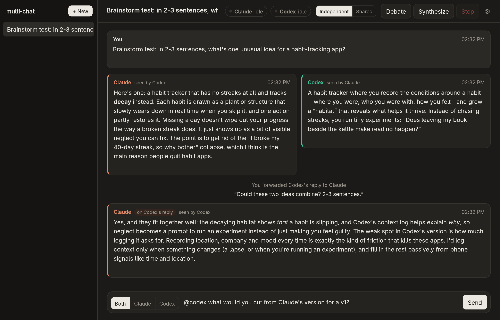

# multi-chat

A group chat between you, Claude Code and Codex, for working through ideas together.



```bash
python3 server.py --open        # http://127.0.0.1:8765
```

It needs only Python 3.11 or newer, with no packages to install. It drives the `claude` and `codex` CLIs you're already logged into, so it uses your existing subscriptions.

### App menu launcher (Linux)

```bash
./launch.py --install
```

This adds **multi-chat** to your desktop's app menu (GNOME, KDE, and others). Opening it starts the server in the background if it isn't already running, then opens the chat in its own window. With a Chromium-based default browser (Brave, Chrome, Vivaldi, …) that's an app window with no tabs or address bar; other browsers get a normal window. The browser starts with the same command as its own menu entry, so your extensions and profile flags still apply. Right-click the icon for **Stop server**. The server's log is in `~/.local/state/multi-chat/server.log`. Use `./launch.py --uninstall` to remove the menu entry.

## What you can do

- **Send** a message to both AIs, or to just one using the target switch or by typing `@claude` / `@codex` in the message. When both reply, their answers show side by side.
- **Forward**: hover over a reply and click **→ Codex** or **→ Claude**. You can add a note ("do you agree with point 2?"). The other AI gets the full reply quoted and is asked for its honest opinion.
- **Debate**: they reply to each other for N rounds while you watch ("2 rounds · 4 replies · Claude starts"). Give it a topic and the first speaker opens on it. Without one, the first speaker responds to the other's latest reply. Before the debate, each AI catches up on the other's replies it hasn't seen. Each turn knows where it falls, and the final speaker closes with agreements, disagreements and a recommendation.
- **Synthesize**: one AI sums up the whole thread: where they agree, where they disagree, open questions and a next step.
- **Stop** kills whatever is running and keeps any partial reply. **Retry** reruns a failed or stopped reply with the same request. For a debate turn, the debate then continues.
- **What was sent**: every AI reply has a button that shows the exact command and prompt that AI received for that turn.
- **Seen by**: each reply shows whether the other AI has received it ("seen by Codex" / "not shared with Codex").

## How it works

Each chat keeps **one persistent session per AI** (`claude -p --resume <id>`, `codex exec resume <id>`), so each one keeps its own memory of the conversation. The server records which messages each AI has already been sent. On every turn it sends only the new ones, labelled by author (`[User]: …`, `[Codex]: …`), together with the action ("the User forwarded this…", "debate turn 2 of 4…").

Each AI is told which visibility mode the chat is in, and told again whenever you switch, so neither mistakes Independent mode for a bug.

Settings for each chat (the **Independent / Shared** toggle in the header, and the ⚙ button):

| Setting | Options |
|---|---|
| What the AIs see of each other | **Independent** (default): an AI sees the other's replies only when you forward, debate or synthesize, so first opinions aren't biased by the other AI. **Shared** (group chat): every turn, each AI catches up on everything it hasn't seen, including the other AI's messages. |
| Tools | Talk only, Read-only (default: can read files in the working directory and search the web), or Can edit. |
| Working directory | By default, an empty folder for each chat. Point it at a project to give them context. It's locked after the first reply, because Claude's sessions are tied to that directory. |
| Model, effort, persona for each AI | Picked from dropdowns: Codex's list comes from `~/.codex/models_cache.json` (the models your account can use), and "Other…" takes any ID. Passed as `--model`/`--effort` (Claude) and `-m`/`model_reasoning_effort` (Codex). A persona such as "you're the skeptic" is sent as a role note. |

Chats are saved as JSON in `data/chats/`, including the prompt each AI was sent on each turn. The full transcripts also stay in each CLI's own session storage.

## Backlog

- **Clean sessions**: an option to run both CLIs without your personal setup. Today Claude inherits your account connectors and global `CLAUDE.md`, and Codex inherits its plugins. The flags that reliably isolate each CLI need testing first.

## Configuration

| Env var | Purpose |
|---|---|
| `CLAUDE_BIN`, `CODEX_BIN` | Override which binaries are used |
| `MULTICHAT_DATA` | Where chats and per-chat workspaces are stored (default `./data`) |

If the `codex` command on your PATH is broken, the server falls back to the native binary inside the npm package. The npm `codex` command is a Node wrapper, so a broken Node install breaks it.

## License

[MIT](LICENSE)
